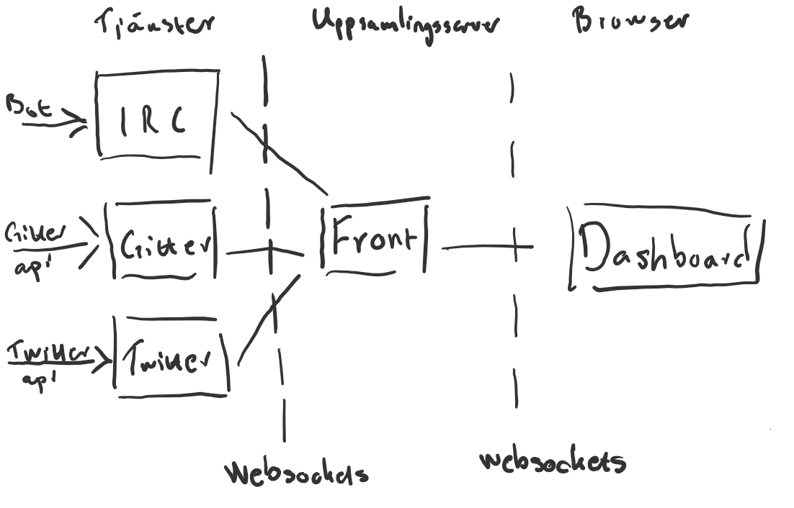

# Dbstream - Inledande dokumentation
version 0.0.1

## Arkitekturöversikt



Att ha fristående tjänster gör det lättare att utveckla nya tjänster.

Tjänsterna ska vara självstående och tillhandahålla möjlighet att koppla in sig via websocket för att få ta del av flödet. Man kan tänka sig ett handskakningsförfarande för att låsa tjänsten med nyckel i framtiden om det skulle visa sig behövas.

Front servern
* samlar flöden från tjänsterna
* tillhandahåller flödet via websocket
* loggar till sqlite-databas
* tillhandahåller en frontend

## Meddelandestruktur
Det skickas jsonobjekt över websockets. Jsonobjekten innehåller en normaliserad del och orginalmedelandet från flödet som respektive tjänst bevakar.

### Preliminär struktur
```
service: irc/gitter/twitter etc
serviceId: sträng som identifierar en lyssnartjänst unikt, tex "irc_putte_v0.0.1"
time: unix tid i millisekunder
to: kanal för irc, sökord för twitter, gitterkanal etc
from: vem som skickade meddelandet
fromImageUrl: url till bild på den som skickade meddelandet
message: meddelandetext
meta: {objekt där tjänsten kan presentera annan data tagen från orginalet}
original: {objekt innehållande orginalet från det avlysnade flödet, olika för olika tjänster}
```

Följande fält kan vara `null`:
* `to`
* `fromImageUrl`
* `meta`
* `original`

Time skall alltid innehålla en tidsstämpel, tillhandahålls ingen ur det avlyssnade flödet används tiden då tjänsten uppfattade meddelandet.

Övriga fält skall vara tomma med rätt typ om de inte har någon data.

### Exempel
```json
{
    "service": "twitter",
    "serviceId": "twitter_litemerafrukt_v0.0.1",
    "time": 1301874515000,
    "to": null,
    "from": "OldGREG85",
    "fromImageUrl": "http://a1.twimg.com/profile_images/455128973/gCsVUnofNqqyd6tdOGevROvko1_500_normal.jpg",
    "message": "RT @PostGradProblem: In preparation for the NFL lockout, I will be spending twice as much time analyzing my fantasy baseball team during ...",
    "meta": null,
    "original": {
          "text": "RT @PostGradProblem: In preparation for the NFL lockout, I will be spending twice as much time analyzing my fantasy baseball team during ...",
          "truncated": true,
          "in_reply_to_user_id": null,
          "in_reply_to_status_id": null,
          "favorited": false,
          "source": "<a href=\"http://twitter.com/\" rel=\"nofollow\">Twitter for iPhone</a>",
          "in_reply_to_screen_name": null,
          "in_reply_to_status_id_str": null,
          "id_str": "54691802283900928",
          "entities": {
                "user_mentions": [
                      {
                            "indices": [
                                  3,
                                  19
                            ],
                            "screen_name": "PostGradProblem",
                            "id_str": "271572434",
                            "name": "PostGradProblems",
                            "id": 271572434
                      }
                ],
                "urls": [ ],
                "hashtags": [ ]
          },
          "contributors": null,
          "retweeted": false,
          "in_reply_to_user_id_str": null,
          "place": null,
          "retweet_count": 4,
          "created_at": "Sun Apr 03 23:48:36 +0000 2011",
          "retweeted_status": {
                "text": "In preparation for the NFL lockout, I will be spending twice as much time analyzing my fantasy baseball team during company time. #PGP",
                "truncated": false,
                "in_reply_to_user_id": null,
                "in_reply_to_status_id": null,
                "favorited": false,
                "source": "<a href=\"http://www.hootsuite.com\" rel=\"nofollow\">HootSuite</a>",
                "in_reply_to_screen_name": null,
                "in_reply_to_status_id_str": null,
                "id_str": "54640519019642881",
                "entities": {
                      "user_mentions": [ ],
                      "urls": [ ],
                      "hashtags": [
                            {
                                  "text": "PGP",
                                  "indices": [
                                        130,
                                        134
                                  ]
                            }
                      ]
                },
                "contributors": null,
                "retweeted": false,
                "in_reply_to_user_id_str": null,
                "place": null,
                "retweet_count": 4,
                "created_at": "Sun Apr 03 20:24:49 +0000 2011",
                "user": {
                      "notifications": null,
                      "profile_use_background_image": true,
                      "statuses_count": 31,
                      "profile_background_color": "C0DEED",
                      "followers_count": 3066,
                      "profile_image_url": "http://a2.twimg.com/profile_images/1285770264/PGP_normal.jpg",
                      "listed_count": 6,
                      "profile_background_image_url": "http://a3.twimg.com/a/1301071706/images/themes/theme1/bg.png",
                      "description": "",
                      "screen_name": "PostGradProblem",
                      "default_profile": true,
                      "verified": false,
                      "time_zone": null,
                      "profile_text_color": "333333",
                      "is_translator": false,
                      "profile_sidebar_fill_color": "DDEEF6",
                      "location": "",
                      "id_str": "271572434",
                      "default_profile_image": false,
                      "profile_background_tile": false,
                      "lang": "en",
                      "friends_count": 21,
                      "protected": false,
                      "favourites_count": 0,
                      "created_at": "Thu Mar 24 19:45:44 +0000 2011",
                      "profile_link_color": "0084B4",
                      "name": "PostGradProblems",
                      "show_all_inline_media": false,
                      "follow_request_sent": null,
                      "geo_enabled": false,
                      "profile_sidebar_border_color": "C0DEED",
                      "url": null,
                      "id": 271572434,
                      "contributors_enabled": false,
                      "following": null,
                      "utc_offset": null
                },
                "id": 54640519019642880,
                "coordinates": null,
                "geo": null
          },
          "user": {
                "notifications": null,
                "profile_use_background_image": true,
                "statuses_count": 351,
                "profile_background_color": "C0DEED",
                "followers_count": 48,
                "profile_image_url": "http://a1.twimg.com/profile_images/455128973/gCsVUnofNqqyd6tdOGevROvko1_500_normal.jpg",
                "listed_count": 0,
                "profile_background_image_url": "http://a3.twimg.com/a/1300479984/images/themes/theme1/bg.png",
                "description": "watcha doin in my waters?",
                "screen_name": "OldGREG85",
                "default_profile": true,
                "verified": false,
                "time_zone": "Hawaii",
                "profile_text_color": "333333",
                "is_translator": false,
                "profile_sidebar_fill_color": "DDEEF6",
                "location": "Texas",
                "id_str": "80177619",
                "default_profile_image": false,
                "profile_background_tile": false,
                "lang": "en",
                "friends_count": 81,
                "protected": false,
                "favourites_count": 0,
                "created_at": "Tue Oct 06 01:13:17 +0000 2009",
                "profile_link_color": "0084B4",
                "name": "GG",
                "show_all_inline_media": false,
                "follow_request_sent": null,
                "geo_enabled": false,
                "profile_sidebar_border_color": "C0DEED",
                "url": null,
                "id": 80177619,
                "contributors_enabled": false,
                "following": null,
                "utc_offset": -36000
          },
          "id": 54691802283900930,
          "coordinates": null,
          "geo": null
    }
}
```
